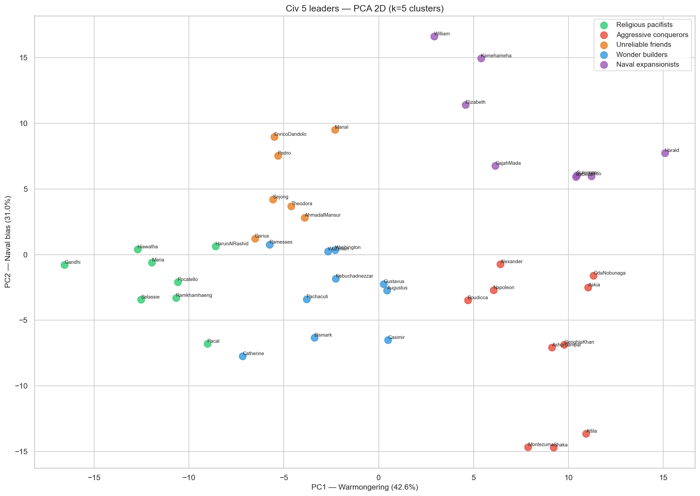
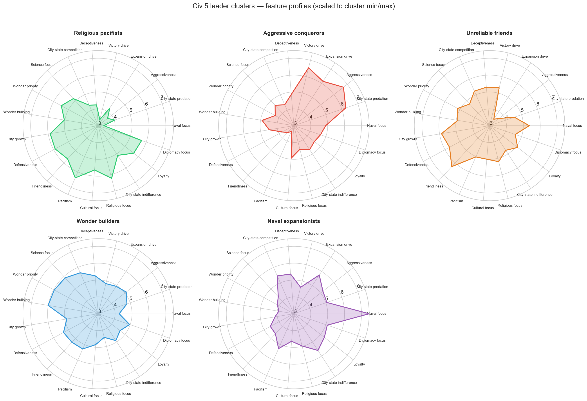
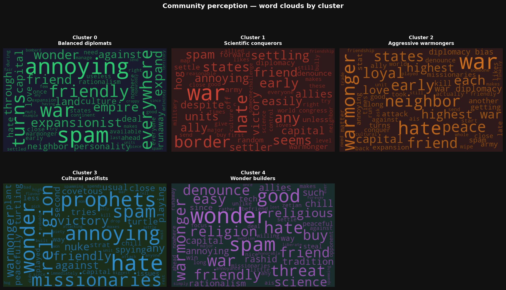

# Civilization V — AI Leader Clustering

    

**Civilization V** is a turn-based strategy video game developed by Firaxis Games and published by 2K in 2010. Each player chooses a "civilization" (representing a nation or ethnic group throughout history, such as the Romans, the Ottomans, the Japanese, etc.) and leads it from prehistoric times into the future. The game ends when one of the players reaches one of several victory conditions, through scientific research, cultural development, economic growth, diplomacy and/or military conquest. Each civilization is led by a historical leader (Napoleon for the French, for example) and has unique units and buildings, making each of the 43 playable civilizations feel distinct.

While multiplayer is possible, the most common experience is playing against AI-controlled civilizations. This AI is fairly competent, offering both a significant challenge and a varied game experience, since every AI-controlled leader has traits which shape their behavior — for example, Genghis Khan, leader of the Mongols, will tend to focus on military conquest, while Gandhi, leader of the Indians, will favor good diplomatic relations with neighboring civilizations and city-states.


*Credit: [r/civ5](https://www.reddit.com/r/civ5/comments/18l6fv9/how_do_i_win_this_first_time_playing_as_arabia/)*

This project clusters the 43 AI leaders of **Civilization V** using their internal XML parameters — the hidden values that govern every diplomatic and strategic decision they make. The results are then cross-validated against qualitative community verbatims scraped from Reddit and CivFanatics, analyzed using the Anthropic Claude API (`claude-sonnet-4-20250514`).

The project follows a scientific methodology throughout: reproducible pipeline, explicit justification of methodological choices, and critical discussion of results and their limits.

---

## Results

K-means clustering (k=5) applied to 19 engineered features produces five well-separated, game-meaningful clusters:

| Cluster | Leaders |
|---|---|
| 🟢 **Religious pacifists** | Gandhi, HarunAlRashid, Hiawatha, Maria, Pacal, Pocatello, Ramkhamhaeng, Selassie |
| 🔴 **Aggressive conquerors** | Alexander, Ashurbanipal, Askia, Attila, Boudicca, GenghisKhan, Montezuma, Napoleon, OdaNobunaga, Shaka |
| 🟠 **Unreliable friends** | AhmadalMansur, Darius, EnricoDandolo, MariaI, Pedro, Sejong, Theodora |
| 🔵 **Wonder builders** | Augustus, Bismark, Casimir, Catherine, Gustavus, Nebuchadnezzar, Pachacuti, Ramesses, Washington, WuZetian |
| 🟣 **Naval expansionists** | Dido, Elizabeth, GajahMada, Harald, Isabella, Kamehameha, Suleiman, William |

### Cluster separation — PCA 2D

PCA reduces the 19-feature space to two interpretable axes. PC1 (~43% of variance) captures **warmongering vs. pacifism**; PC2 (~31%) captures **naval bias**.



Some leaders sit on the edge between two clusters. Pacal, for instance, borders the "Wonder builders" despite landing in "Religious pacifists", due to his strong religious and pacifist character outweighing his interest in wonders. More surprisingly, Sejong ends up in "Unreliable friends" rather than "Wonder builders" — his scientific profile fits the latter, but his low appetite for conquest — unlike the other "Wonder builders" — sets him apart from that cluster. 
These cases reflect the inherent complexity of condensing a large number of features — representing complex civilization strategies, mixing both diplomatic and strategic traits — into a single feature space.

### Cluster profiles — Radar chart

Each cluster shows a distinct feature profile. The most striking signals:
- **Religious pacifists**: high pacifism, high religious focus, low military, low expansion drive
- **Aggressive conquerors**: high military focus, high victory drive, low pacifism, low friendliness
- **Unreliable friends**: high friendliness and deceptiveness simultaneously — friendly on the surface, competitive underneath
- **Wonder builders**: high wonder priority and wonder building, fed from a science focus
- **Naval expansionists**: by far the highest naval focus (7.5 average), low wonder-building interest, low city growth



---

## Community validation

To cross-validate the XML-based clustering, two external sources were used. First, a player personality classification from community feedbacks on CivFanatics shows broad alignment with the clustering results.
Second, and more robustly, **234 community posts** (4 Reddit threads + 3 CivFanatics threads) were scraped and parsed, and the resulting 432 leader verbatims were analyzed using the Anthropic Claude API — extracting sentiment scores (weighted by upvotes) and perceived archetypes per leader and per cluster.



The community analysis from the threads **partially validates** the clustering, with a clear pattern: *the stronger a cluster's defining trait is felt in-game, the better the community captures it.*

- **Religious pacifists** — strong match on religious spreading ("religion", "missionaries", "spam"). Interestingly, this cluster receives the most negative sentiment despite being the most pacifist — players are particularly irritated by relentless religious pressure.
- **Aggressive conquerors** — strongest match: "war", "hate", "warmonger" dominate. The cluster's defining behavior is directly experienced by players.
- **Unreliable friends** — partial match: "chill", "good", "friendly" reflect the cluster identity, but "warmonger" and "war" also appear, reflecting the heterogeneity within this group.
- **Wonder builders** — weak match: "wonder" is present but mixed with many other signals.
- **Naval expansionists** — most striking divergence: the naval identity (naval score = 7.5, the strongest signal in the entire dataset) is **entirely absent** from community discussions. The likely explanation: Pangaea is by far the most played map, which removes naval gameplay almost entirely. The cluster is real in the XML data but nearly invisible in player experience.

> ⚠️ *The community dataset skews negative: some of the selected threads like "Most annoying civ in the game" from Reddit obviously call for negative comments. Sentiment scores reflect this bias and should be interpreted accordingly.*

---

## Method

### Data source
Leader parameters were extracted directly from Civilization V's XML files (`Civ5Leaders.xml`), which define every AI personality trait — diplomatic stances, military flavors, strategic priorities, and approach weights.

### Feature engineering (`03`)
65 raw parameters were reduced to **19 raw or composite features** by grouping correlated variables and computing weighted averages:
`WarmongerHate` · `WonderCompetitiveness` · `VictoryCompetitiveness` · `Loyalty` · `MinorCivCompetitiveness` · `warrior` · `friendliness` · `deceptiveness` · `city_state_benefactor` · `minor_ignore` · `naval` · `defense` · `science` · `EXPANSION` · `GROWTH` · `WONDER` · `CULTURE` · `RELIGION` · `DIPLOMACY`

### Clustering (`04`)
- Algorithm: **K-Means** (k=5, selected by elbow curve + silhouette score)
- DBSCAN was tested but found no meaningful structure (all 43 leaders flagged as noise at eps=4.0), confirming K-Means as the appropriate choice
- Visualization: PCA 2D and UMAP

### Community analysis (`06–07`)
- Vox Populi comparison (06): cross-tabulation of K-means clusters against a community personality classification (4 archetypes: CONQUEROR, COALITION, DIPLOMAT, EXPANSIONIST) built by Recursive (CivFanatics, 2021); association measured with Cramér's V
- Qualitative analysis (07): scraping of 234 posts (Reddit JSON API + BeautifulSoup for CivFanatics); structured LLM calls via Anthropic API (`claude-sonnet-4-20250514`) per message chunk → 432 labeled leader verbatims; sentiment scoring (−1 / 0 / +1 per mention, weighted by normalized upvotes); archetype extraction via LLM on aggregated verbatims per leader and per cluster; wordcloud generation per cluster


---

## Repo structure

```
├── notebooks/
│   ├── 00_import_xml.ipynb         # XML extraction from Civ5 install
│   ├── 01_parsing.ipynb            # Raw parsing → 65-column leaders CSV
│   ├── 02_exploration.ipynb        # EDA, correlation matrices
│   ├── 03_feature_engineering.ipynb # Composite features (19 features)
│   ├── 04_clustering.ipynb         # K-Means, PCA, UMAP
│   ├── 05_results.ipynb            # Cluster profiles, radar, heatmap
│   ├── 06_comparison_voxpop.ipynb  # Vox Populi community classification
│   └── 07_comparison_qualitative.ipynb # Reddit/CivFanatics + LLM analysis
├── data/
│   ├── raw_traits/                 # XML files (not committed — needs local Civ5)
│   ├── raw_community/              # Raw Reddit and CivFanatic threads (in .json or .txt)
│   ├── processed_traits/           # Parsed CSVs (leaders, features, clusters)
│   └── processed_community/        # Scraped posts, mentions, archetypes
├── figures/                        # All generated plots
└── requirements.txt
```

---

## Setup

### Requirements
```bash
python -m venv .venv
source .venv/bin/activate
pip install -r requirements.txt
```

### Environment variables
Copy `.env.example` to `.env` and fill in:

```env
# Path to your local Civilization V Steam installation
PATH_CIV5GAME="/path/to/steamapps/common/Sid Meier's Civilization V"

# Anthropic API key — required for notebook 07
ANTHROPIC_API_KEY="sk-ant-..."
```

> Notebook `00` requires a local Civ5 installation to extract the XML files. All subsequent notebooks can run from the pre-processed CSVs in `data/processed_traits/`.  
> Notebook `07` requires an Anthropic API key for LLM calls.

### Stack
Python 3.11 · pandas · scikit-learn · umap-learn · matplotlib · seaborn · anthropic · beautifulsoup4 · rapidfuzz